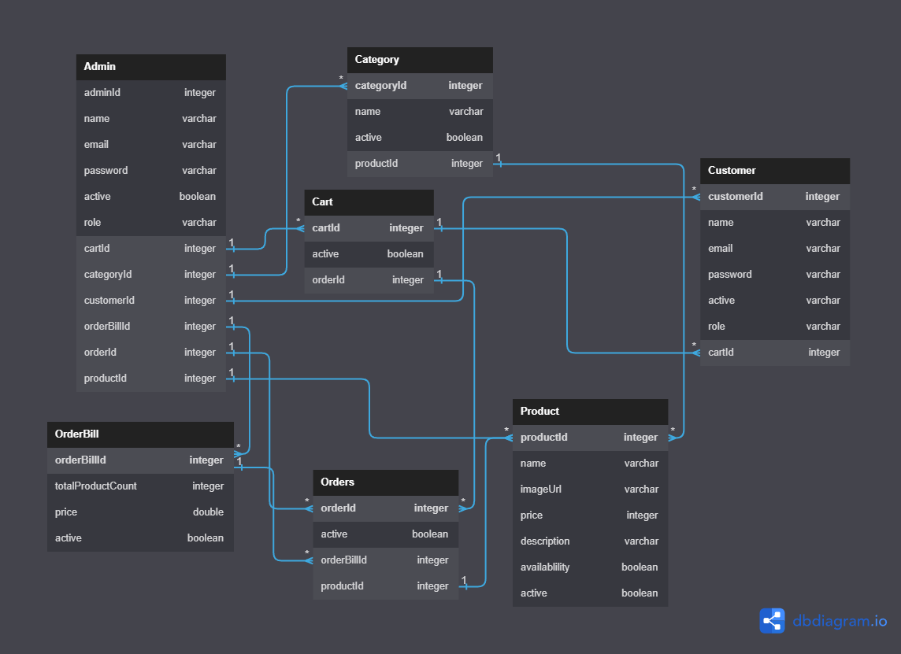

# Online-Sweet-Mart


This is an backend application in which me my team of 3 members have created restful API to mimic the working of online sweet shop. We have used spring security to authenticate and authorise customer and admin access to the application. For the frotend part we have used HTML, CSS and JS.


# Features

* Customer and admin both have been authenticated using spring security
* We have created multiple modules to facilitate the seamless transections between the application and database


# Tech Stack
- HTML
- CSS
- JS
- Core JAVA
- MySql
- Spring Boot
- Spring Security
- Spring Data JPA
- Maven
- Hibernate

# Modules
- Login, Sign up Module
- Admin Module
- Customer Module


# ER Diagram
The following Diagram depicts the flow of our Entity Relation Diagram to simplify the work flow.



## Installation & Run

* Before running the API server, you should update the database config inside the [application.properties](https://github.com/Siddharth263/nippy-needle-3633/blob/main/otms/otms/src/main/resources/application.properties) file. 
* Update the port number, username and password as per your local database config.

```
    spring.datasource.url=jdbc:mysql://localhost:3306/SweetMart;
    spring.datasource.driver-class-name=com.mysql.cj.jdbc.Driver
    spring.datasource.username=root
    spring.datasource.password=root
    
    
    
## API Root Endpoint

`http://localhost:8080/`

`http://localhost:8080/swagger-ui/`
